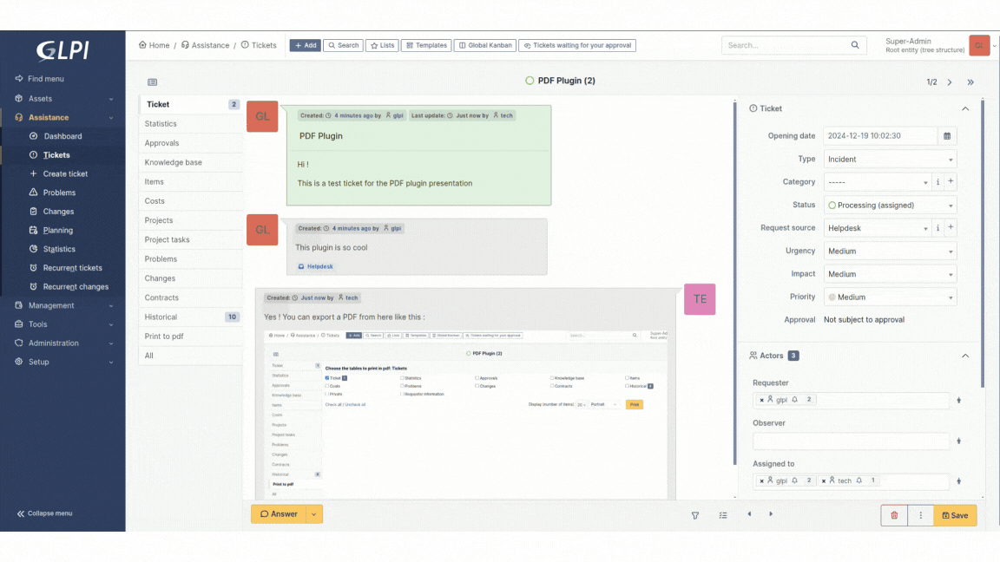

# PDF GLPI plugin

This plugin allow you to select and export informations of an equipment to PDF file.
- equipment types from GLPI
- equipment types from some plugins
- additional data from some plugins
- one or many object(s) in a file

## Download

Releases can be donwloaded on [GitHub](https://github.com/PluginsGLPI/pdf/releases).

## Documentation

We maintain a detailed [documentation](http://glpi-plugins.rtfd.io/en/latest/pdf/index.html).

## Contact

For notices about major changes and general discussion of pdf, subscribe to the [/r/glpi](https://www.reddit.com/r/glpi/) subreddit.
You can also chat with us via [@glpi on Telegram](https://t.me/glpien).

## Professional Services

The GLPI Network services are available through our [Partner's Network](http://www.teclib-edition.com/en/partners/).
We provide special training, bug fixes with editor subscription, contributions for new features, and more.

Obtain a personalized service experience, associated with benefits and opportunities.

## Contributing

* Open a ticket for each bug/feature so it can be discussed
* Follow [development guidelines](http://glpi-developer-documentation.readthedocs.io/en/latest/plugins/index.html)
* Refer to [GitFlow](http://git-flow.readthedocs.io/) process for branching
* Work on a new branch on your own fork
* Open a PR that will be reviewed by a developer

## Copying

* **Code**: you can redistribute it and/or modify it under the terms of the GNU General Public License ([AGPL-3.0](https://www.gnu.org/licenses/agpl-3.0.html)).